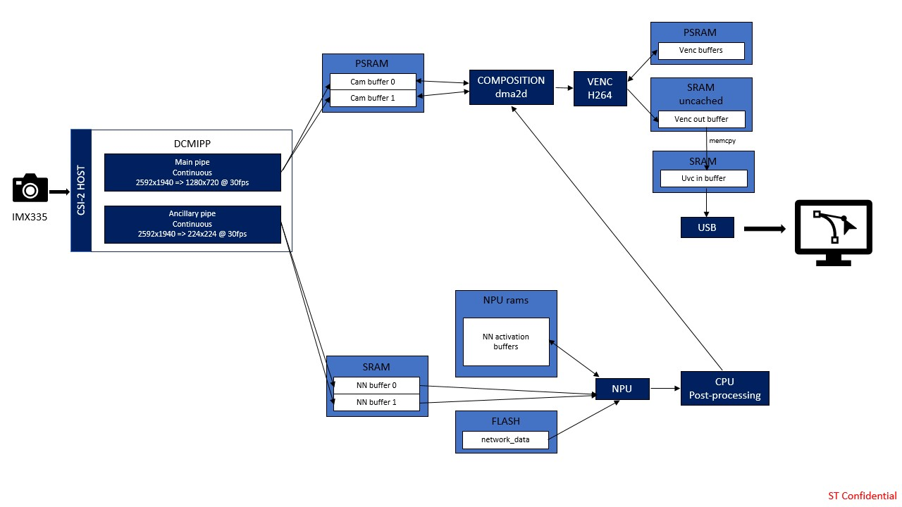
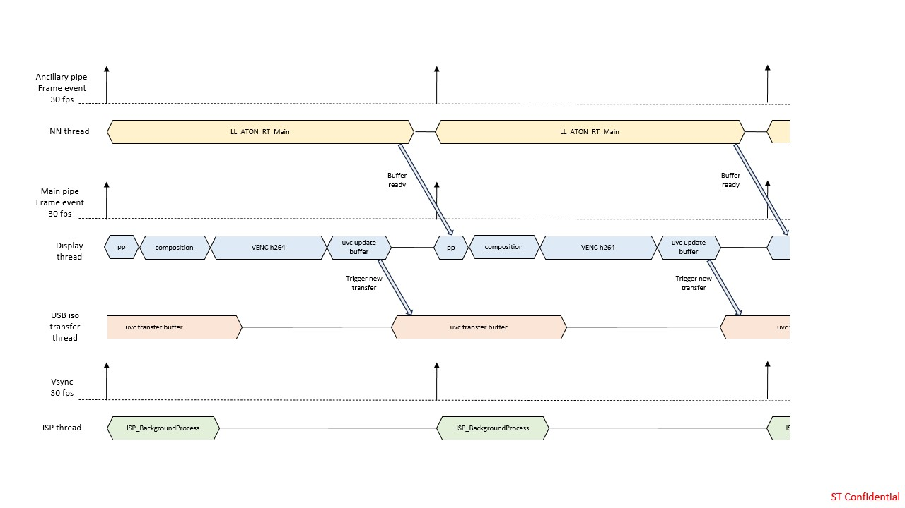

# Application Overview

### Application Data Flow

### Application Timing Diagram

## Memory Footprint Details

### Read-Only Data

| Name           | Size     | Location | Notes          |
|----------------|----------|----------|----------------|
| `network_data` | 10.59 MB | .rodata  | FLASH xSPI2 8b |
| `figs`         | 160 KB   | .rodata  | SRAM           |

### Read-Write Data

| Name                       | Size     | Location       | Notes                               |
|----------------------------|----------|----------------|-------------------------------------|
| `capture_buffer`           | 11 MB    | .psram_bss     | PSRAM / (1280x720x4) x 3 / ARGB8888 |
| `nn_input_buffers`         | 294 KB   | .psram_bss     | PSRAM / (224x224x3) x 2 / RGB888    |
| `nn_output_buffers`        | 12 KB    | .bss           | SRAM / 5880 x 2                     |
| `venc_out_buffer`          | 255 KB   | .uncached_bss  | SRAM uncached memory                |
| `uvc_in_buffers`           | 255 KB   | .bss           | SRAM                                |
| `activations`              | 507 KB   | 0x34200000     | NPURAMS                             |
| `venc_hw_allocator_buffer` | 4 MB     | .psram_bss     | PSRAM / Venc internal buffers       |
| `threads stacks`           | 16 KB    | .bss           | SRAM / 4096 * 4                     |
| `usbx_mem_pool`            | 32 KB    | .bss           | SRAM                                |
| `usbx_mem_pool_uncached`   | 32 KB    | .uncached_bss  | SRAM uncached memory                |

## DCMIPP/ISP

### DCMIPP Overview

- Pipe 1 is enabled using `CMW_CAMERA_Start(DCMIPP_PIPE1, *ptr_dst, CAMERA_MODE_CONTINUOUS);` to continuously transmit images from imx335 to the CAPTURE_BUFFER_NB buffered `capture_buffer[]`. Note that `ptr_dst` will be updated at pipe1 frame_event.
- Pipe 2 is enabled using `CMW_CAMERA_Start(DCMIPP_PIPE2, *ptr_dst, CAMERA_MODE_CONTINUOUS);` to continuously transmit images from imx335 to the double buffered `nn_input_buffers[]`. Note that `ptr_dst` will be updated at pipe2 frame_event. This allows dropping the previous frame if the buffer is still in use by the nn thread.
- For each capture, the ISP configuration is updated to enhance the image quality depending on the illumination conditions. It is initialized through `ISP_Init` and then executed with `ISP_BackgroundProcess`.

For more details on DCMIPP, see the Digital Camera Interface Pixel Pipeline (DCMIPP) section in the STM32N6 Reference Manual.