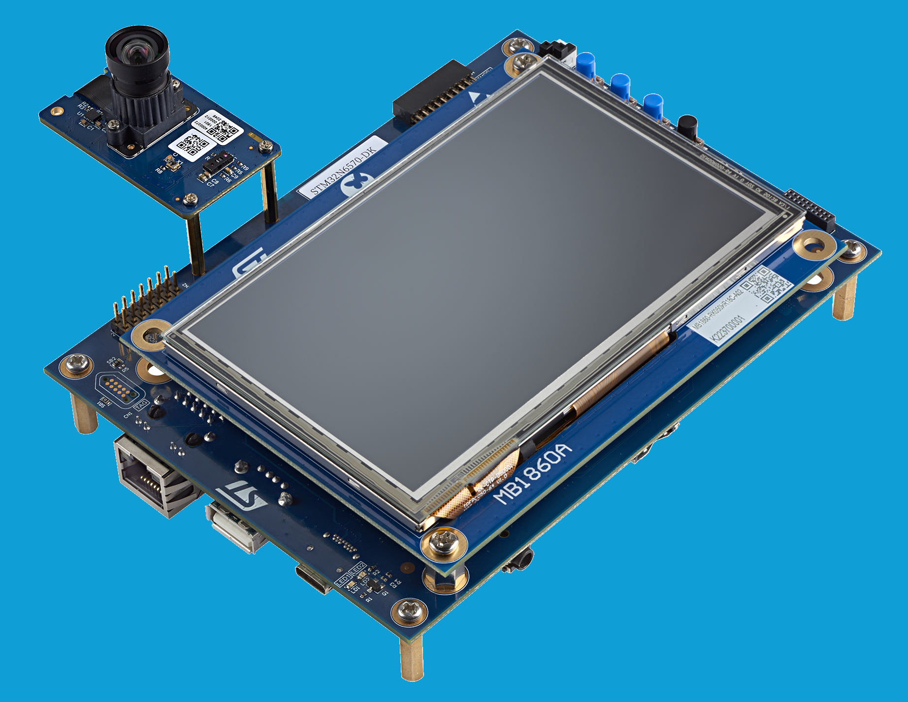
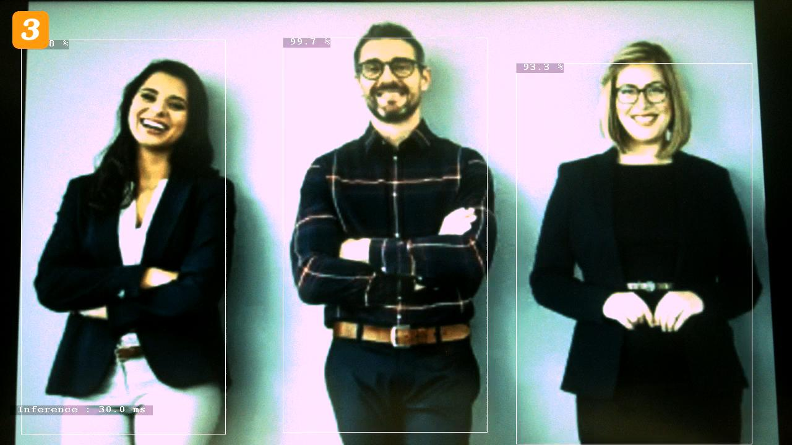

# x-cube-n6-ai-h264-usb-uvc Application

Computer Vision application demonstrating the deployment of object detection models on the STM32N6570-DK board and stream results through USB using UVC/H264 format.

Following UVC resolution and framerate will be output according to connected camera :
- 1280x720@30fps for IMX335
- 1120x720@30fps for VD66GY
- 640x480@30fps for VD55G1
- 1280x720@30fps for VD1943

This top readme gives an overview of the app. Additional documentation is available in the [Doc](./Doc/) folder.

---

## Doc Folder Content

- [Application overview](Doc/Application-Overview.md)
- [Boot Overview](Doc/Boot-Overview.md)
- [Camera build options](Doc/Build-Options.md)

---

## Features Demonstrated in This Example

- Multi-threaded application flow (FreeRTOS)
- NPU accelerated quantized AI model inference
- Dual DCMIPP pipes
- DCMIPP crop, decimation, downscale
- DCMIPP ISP usage
- H264 encoder
- USB UVC (Azure RTOS USBX)
- Dev mode
- Boot from external flash

---

## Hardware Support

Supported development platforms:

- [STM32N6570-DK](https://www.st.com/en/evaluation-tools/stm32n6570-dk.html) Discovery Board
  - Connect to the onboard ST-LINK debug adapter (CN6) using a __USB-C to USB-C cable__ for sufficient power.
  - An additional USB cable to connect USB1 (CN18) to the host computer for UVC streaming.
  - OTP fuses are configured for xSPI IOs to achieve maximum speed (200MHz) on xSPI interfaces.


STM32N6570-DK board with MB1854B IMX335.

Supported camera modules:

- Provided IMX335 camera module
- [STEVAL-55G1MBI](https://www.st.com/en/evaluation-tools/steval-55g1mbi.html)
- [STEVAL-66GYMAI1](https://www.st.com/en/evaluation-tools/steval-66gymai.html)
- [STEVAL-1943-MC1](https://www.st.com/en/evaluation-tools/steval-1943-mc1.html)

---

## Tools Version

- IAR Embedded Workbench for Arm (__EWARM 9.40.1__) + N6 patch ([__EWARMv9_STM32N6xx_V1.0.0__](STM32Cube_FW_N6/Utilities/PC_Software/EWARMv9_STM32N6xx_V1.0.0.zip))
- [STM32CubeIDE](https://www.st.com/content/st_com/en/products/development-tools/software-development-tools/stm32-software-development-tools/stm32-ides/stm32cubeide.html) (__v1.17.0__)
- [STM32CubeProgrammer](https://www.st.com/en/development-tools/stm32cubeprog.html) (__v2.18.0__)
- [STEdgeAI](https://www.st.com/en/development-tools/stedgeai-core.html) (__v3.0.0__)

---

## Boot Modes

The STM32N6 series does not have internal flash memory. To retain firmware after a reboot, program it into the external flash. Alternatively, you can load firmware directly into SRAM (development mode), but note that the program will be lost if the board is powered off in this mode.

Development Mode: used for loading firmware into RAM during a debug session or for programming firmware into external flash.

Boot from Flash: used to boot firmware from external flash.

|                  | STM32N6570-DK                                                                |
| -------------    | -------------                                                                |
| Boot from flash  |  |
| Development mode |        |

---

## Console parameters

You can see application messages by attaching a console application to the ST-Link console output. Use the following console parameters:
- Baud rate of 115200 bps.
- No parity.
- One stop bit.

---

## Quickstart using prebuilt binaries

### Flash Prebuilt Binaries

Three binaries must be programmed in the board's external flash using the following procedure:

1. Set the board to [development mode](#boot-modes).
2. Program `Binary/STM32N6570-DK/x-cube-n6-ai-h264-usb-uvc-dk.hex`.
3. Set the board to [boot from flash mode](#boot-modes).
4. Power cycle the board.
5. Connect usb cable between host and USB1 (CN18).
6. [Launch host camera application](#launch-host-camera-application)
7. Detected people are surrounded by a rectangle with the associated confidence level.

---

### How to Program Hex Files Using STM32CubeProgrammer UI

See [How to Program Hex Files STM32CubeProgrammer](Doc/Program-Hex-Files-STM32CubeProgrammer.md).

---

### How to Program Hex Files Using Command Line

Make sure to have the STM32CubeProgrammer bin folder added to your path.

```bash
export DKEL="<STM32CubeProgrammer_N6 Install Folder>/bin/ExternalLoader/MX66UW1G45G_STM32N6570-DK.stldr"

STM32_Programmer_CLI -c port=SWD mode=HOTPLUG -el $DKEL -hardRst -w Binary/STM32N6570-DK/x-cube-n6-ai-h264-usb-uvc-dk.hex
```

---

### Launch Host Camera Application

Observe the streaming of the camera and the output of the computer vision network on a camera application:



- **Linux users:**
  Use a webcam application that is able to decode H264 (e.g., guvcview, VLC).

- **Windows users:**
  Install [ffmpeg](https://www.gyan.dev/ffmpeg/builds/ffmpeg-release-full.7z) and then run the following command:
  ```bash
  ffplay.exe -f dshow -i video="STM32 uvc"
  ```

---

## Quickstart Using Source Code

Before building and running the application, you have to program `network_data.hex` (model weights and biases).

This step only has to be done once unless you change the AI model. See [Quickstart Using Prebuilt Binaries](#quickstart-using-prebuilt-binaries) for details.

More information about boot modes is available in the [Boot Overview](Doc/Boot-Overview.md).

### Application Build and Run - Dev Mode

Set your board to [development mode](#boot-modes).

#### STM32CubeIDE

Double-click on `STM32CubeIDE/.project` to open the project in STM32CubeIDE. Build and run using the build and run buttons.

#### IAR EWARM

Double-click on `EWARM/Project.eww` to open the project in the IAR IDE. Build and run using the build and run buttons.

#### Makefile

Before running the commands below, make sure to have the necessary commands in your PATH.

1. Build the project using the provided `Makefile`:

```bash
make -j8
```

2. Open a GDB server connected to the STM32 target:

```bash
ST-LINK_gdbserver -p 61234 -l 1 -d -s -cp <path-to-stm32cubeprogramer-bin-dir> -m 1 -g
```

3. In a separate terminal session, launch a GDB session to load the firmware image into the device memory:

```bash
$ arm-none-eabi-gdb build/Project.elf
(gdb) target remote :61234
(gdb) monitor reset
(gdb) load
(gdb) continue
```

#### Launch Host Camera Application

See [instructions above](#launch-host-camera-application)

### Application Build and Run - Boot from Flash

Set your board to [development mode](#boot-modes).

#### STM32CubeIDE

Double-click on `STM32CubeIDE/.project` to open the project in STM32CubeIDE. Build with build button.

#### IAR EWARM

Double-click on `EWARM/Project.eww` to open the project in the IAR IDE. Build with build button.

#### Makefile

Before running the commands below, make sure to have the necessary commands in your PATH.

1. Build the project using the provided `Makefile`:

```bash
make -j8
```

Once your app is built with Makefile, STM32CubeIDE, or EWARM, you must add a signature to the bin file:
```bash
STM32_SigningTool_CLI -bin build/Project.bin -nk -t ssbl -hv 2.3 -o build/Project_sign.bin
```

You can program the FSBL, the signed bin file at the address 0x70100000 and the network parameters:

```bash
export DKEL="<STM32CubeProgrammer_N6 Install Folder>/bin/ExternalLoader/MX66UW1G45G_STM32N6570-DK.stldr"

# First Stage Boot Loader
STM32_Programmer_CLI -c port=SWD mode=HOTPLUG -el $DKEL -hardRst -w FSBL/ai_fsbl.hex

# Network Parameters and Biases
STM32_Programmer_CLI -c port=SWD mode=HOTPLUG -el $DKEL -hardRst -w Model/network_data.hex

# Adapt build path to your IDE
STM32_Programmer_CLI -c port=SWD mode=HOTPLUG -el $DKEL -hardRst -w build/Project_sign.bin 0x70100000
```

__Note__: Only the application binary needs to be programmed if `fsbl` and `network_data.hex` have already been programmed.

Set your board to [boot from flash](#boot-modes) mode and power cycle to boot from external flash.

---

## How to update my project with a new version of ST Edge AI

The neural network model files (`network.c/h`, `stai_network.c/h`, etc.) included in this project were generated using [STEdgeAI](https://www.st.com/en/development-tools/stedgeai-core.html) version 3.0.0.

Using a different version of STEdgeAI to generate these model files may result in the following compile-time error:  
`Possible mismatch in ll_aton library used`.

If you encounter this error, please follow the STEdgeAI instructions on [How to update my project with a new version of ST Edge AI Core](https://stedgeai-dc.st.com/assets/embedded-docs/stneuralart_faqs_update_version.html) to update your project.

---

## Known Issues and Limitations

- (VENC_IMX335_WIDTH * 4) must be a multiple of 16
- VENC_IMX335_WIDTH must be greater or equal to VENC_IMX335_HEIGHT
- VENC_VD66GY_WIDTH must be greater or equal to VENC_VD66GY_HEIGHT
- VENC_VD55G1_WIDTH must be greater or equal to VENC_VD55G1_HEIGHT
